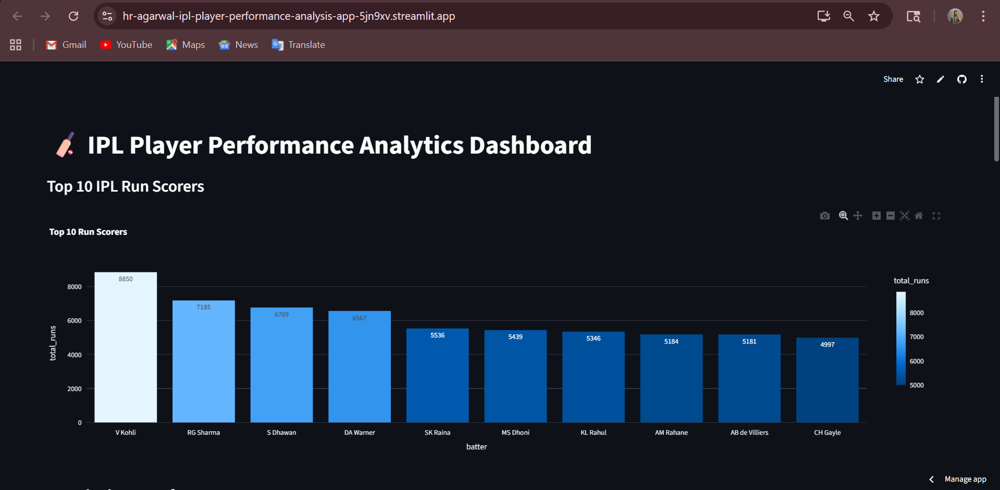
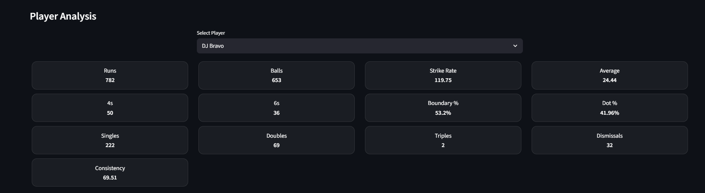
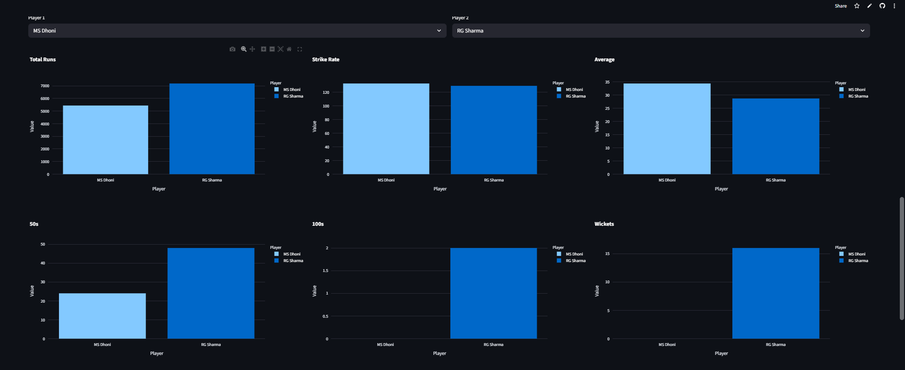

# IPL Player Performance Analytics (Data Engineering Project)

🚀 **Live App:** https://hr-agarwal-ipl-player-performance-analysis-app-5jn9xv.streamlit.app/

---

## Overview

This project builds an end-to-end data engineering pipeline to analyze IPL player performance using ball-by-ball match data. It includes data ingestion, transformation, storage using CSV files, and an interactive dashboard for visualization.

---

## Demo Preview







---

## Features

* Player performance metrics (runs, strike rate, average, 50s, 100s)
* Advanced analytics (boundary %, dot ball %, consistency)
* Best batting (runs/balls) and best bowling (wickets/runs)
* Top 10 run scorers visualization
* Player vs Player comparison
* Bowler vs Batter matchup analysis
* Interactive Streamlit dashboard

---

## Tech Stack

* Python (Pandas)
* CSV (Data Storage)
* Streamlit (Frontend Dashboard)
* Plotly (Visualization)

---

## Data Pipeline

Raw IPL JSON data is processed and transformed into structured format.

```
JSON → Pandas ETL → CSV → Streamlit Dashboard
```

---

## Data Design (Conceptual)

The system follows a simplified schema:

* **batting_stats** (aggregated player performance)
* **ball_by_ball** (delivery-level data)

**Relationship:**
One player → many ball-by-ball records

(Note: In production systems, a unique `player_id` would be used instead of player names.)

---

## Project Structure

```
cricket_project/
│
├── data/                     # Raw JSON files
├── advanced_batting_stats.csv
├── ipl_ball_by_ball.csv
├── 1_data_pipeline.ipynb     # ETL pipeline
├── app.py                    # Streamlit dashboard
└── README.md
```

---

## Setup Instructions

### 1. Install Dependencies

```
pip install pandas streamlit plotly
```

---

### 2. Run Data Pipeline

Run the notebook:

```
1_data_pipeline.ipynb
```

This will:

* Process raw data
* Generate CSV files

---

### 3. Run Dashboard

```
streamlit run app.py
```

---

## Deployment Note

The project uses CSV files instead of a database to ensure easy deployment on Streamlit Cloud without requiring external database configuration.

---

## Key Insights

* Identify top-performing players
* Analyze consistency and strike efficiency
* Compare players across multiple metrics
* Evaluate bowler vs batter matchups

---

## Future Improvements

* Add caching for faster performance
* Introduce normalized database schema (player_id, match_id)
* Integrate cloud database (AWS / GCP)
* Add team-level analytics

---

## Author

**Harsh Raj Agarwal**
